# Solving Difficult Math Problems
**Members: Tonyaradzwa Chivandire, Salih Erdal**
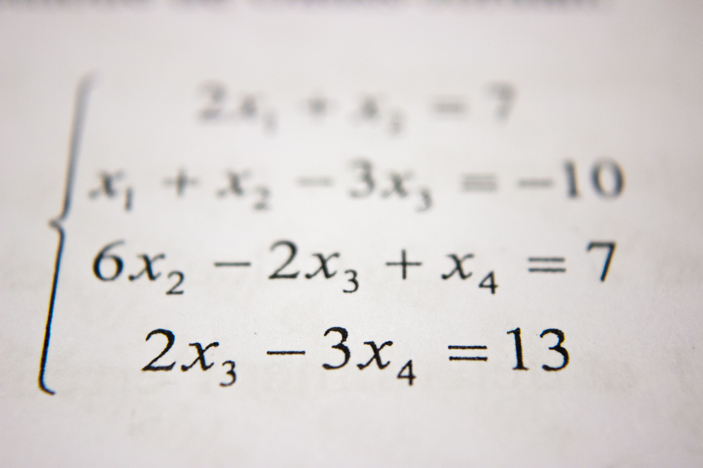

## Abstract

We train a seq2seq LSTM neural network to solve arithmetic problems inputted as a sequence of characters. We explain some of the problems we face due to having to decide the number of characters in our input and output sequences, i.e., having too many pad characters. We train models for two pairs of maximum question and answer lengths: (20,5) and (30,10), and get much better results with the second pair due to the increased number of sample sizes. We also get about 1% increase in accuracy for a bigger sized encoder LSTM layer, although not being able to change much of the other hyperparameters because of time constraints. We talk about how the actual accuracy metric we are interested in is not the same as the default accuracy returned by the model, and that there is a big difference between the two even in the best model. Lastly, after presenting some of the predictions of our best model on some questions, we relate our reflections regarding the project. 

## Introduction

Can a computer learn to solve math problems? This question motivates our study, and we seek to explore computers' problem-solving abilities in different areas of math by utilizing neural network architectures, e.g., recurrent NNs. 

The difficulty in teaching computers how to solve problems lies mainly in the fact that computers cannot "digest" a problem in the same way that humans do. When humans encounter problems, they extract the relevant information from what they are given; they decipher the pragmatic meaning of the terms to identify what the question is asking and apply a sequence of steps to arrive at a solution by using techniques that are not immediate in the questions. This is called mathematical reasoning, and whether computers can learn mathematical reasoning forms the basis of our inquiry. 

Before going into what exactly will constitute our research, we present a brief overview of the current literature. The area of using ML algorithms to teach computers how to solve math quesitons is relatively new, since it seems to be quite a challenging task that isn't very clearly defined. Since solving all kinds of math problems is not conceivable, current research usually focuses on solving problems in specific areas of math. Consequently, there are different methods tried for solving problems in different fields. One of the seemingly easier kinds of problems that people have focused on as proof of concept are arithmetic word problems. For example,[**Text2Math: End-to-end Parsing Text into Math Expressions**](https://arxiv.org/abs/1910.06571) by Yanyan Zou, Wei Lu. 2019 focuses on parsing arithmetic word problems and equations in a tree structure, which then can be solved. However, this method of creating expression trees is limited, since it is conceivably hard for computers to turn most of the more interesting questions into a tree format. This is because interesting questions require ingenuity, so that their solutions might not be expressible with common algebraic manipulations like addition, subtraction that are easily available to the computer. It is also the case that converting a word problem into an expression tree for a computer already assumes a good sense of mathematical maturity, which is the problem we have started with anyways. A more common approach to developing more generalizable mathematical reasoning abilities for computers is to use recurrent neural networks. In these kinds of papers, the task of solving math questions is treated more like a machine translation/NLP task so that each problem is "translated" to a solution. For example, a [**study**](https://ai.facebook.com/blog/using-neural-networks-to-solve-advanced-mathematics-equations/) done by the Facebook AI team uses sequence-to-sequence models by feeding the NN a sequence of expressions representing math problems. Similar to the other study, this study mainly focuses on problems that can be converted into a tree structure, which are then converted to a sequence of expressions. Another [**study**](https://openreview.net/pdf?id=H1gR5iR5FX) by David Saxton et al. similarly used LSTM and seq2seq models. However, they differed in their approach by inputting problems in free text format instead of preprocessing them into a structure. They generated their own dataset of problem-solution pairs in textual input/output form, and they compared the performances of the two models. 

In our research, we will try to implement the method that Saxton et al. applied in their paper and will use the synthetic dataset from their [**study**](https://openreview.net/pdf?id=H1gR5iR5FX)  in doing so. However, we will initially limit ourselves to trying to train a model to solve problems in only one field, which we might then apply to other fields. Through this research, we hope to get a better understanding of LSTM architectures by doing the implementation ourselves, and getting an intuition of why it might be better at solving some kinds of problems compared to other models. We think their method overcomes the difficulty of having to structurally represent problems in some format, and seems most open to experiment on. 

Some techincal challenges we anticipate facing include creating meaningful embeddings, deciding how to parse the input, and getting a sound understanding of how we can best utilize the LSTM architecture for our own problem. We also have to deal with limited computing resources, and we expect the size of our training dataset to potentially decrease the accuracy of our model. Minimally, we expect our model to perform with 70% accuracy for the arithmetic problems, which will be our first and primary focus.

After completing our research and training our model, we hope to be able to get a sense of what kinds of problems our model is best at solving. We might also compare the results of our study with those in Yanyan et al.'s paper that tried to create expression trees to solve arithmetic word problems. 

## Methods

As we mentioned earlier, we use the [dataset](https://github.com/deepmind/mathematics_dataset) containing millions of problem solution pairs for different math modules. We are using the [**`tensorflow`**](https://www.tensorflow.org/overview) library for our NN models in addition to [**`scikit`**](https://scikit-learn.org/stable/) for some helpful methods during training. We trained our model on one simple module, Arithmetic, containing multiple operations (addition, subtraction, division, multiplication) as well as parentheses. Our model is a seq2seq neural network. These types of networks accept a sequence of characters/tokens and output a sequence of characters/tokens. They are usually used in cases when there is a dependancy between the tokens in the input, hence they are fed as a sequence into what are called RNNs (recurrent neural networks). This first layer of RNNs are called encoder, and they help in extracting information about the reationship between the characters in the input sequence. This new sequence outputted by the encoder LSTM carrying added complexity and information is then used as the input sequence into another RNN called the decoder RNN. We finally get the sequence of tokens back from this layer as our result to be fed into an activation layer or a fully connected layer depending on the situation. We will use one directional LSTMs in our network, which are a kind of RNN, as they are demonstrated to be better at dealing with the problem of vanishing and exploding gradients compared to basic RNNs.  So our model is composed of the following layers:

`Embedding -> Encoder LSTM -> RepeatVector -> Decoder LSTM -> Fully Connected -> Softmax` 

If we let `n,m` be the maximum length of a given (problem, solution) pair in terms of number of characters in each of them, and let `v` be the number of unique characters in our dataset. Our model takes in a `n x 1` vector where entries are the indices of the characters in the problem(with indices according to a vocabulary). The `Embedding` layer encodes this information one step further, and turns the inputted vector into a `n x 30` matrix where each character is now represented as a 30-dimensional vector. The `Encoder LSTM` outputs a vector with dimension 128, where each column represents the hidden states from the last timestep. The `RepeatVector` layer repeats the output of the `Encoder LSTM` layer `m` times so that the input to the `Decoder LSTM` is exactly the length of the sequence we expect it to output. Finally, `Time Distributed` layer gives us a `m x v` matrix, where the rows are representing probability distributions over the vocabularity for each character of the answer. The `Softmax` activation layer reduces the range of the numbers in the rows to between 0-1, so that each row can now be one-hot decoded to actual letters. 

To train the seq2seq model on batches, we had to specify a certain length both for the input sequence(question) and the output sequence(answer). So, we chose (20,5) and (30,10) as two pairs of maximum lengths for questions and answers, which meant that we only trained and tested our models on a subset of the original dataset. To make all questions and answers the same length, we added right-padding to complete the questions and answers to the specified length. This meant, for example, that we had quite many empty pad characters added to the end of many questions and answers. Essentially, this posed a challenge for us, since we had to "tell" the NN to ignore these as meaningless characters. This was achieved by adding the "mask_zero=True" option to the embedding layer. 

## Discussion

We tried several configurations of our model for this task. Each configuration varied in the maximum length of the question (n) and in the maximum length in of the answer (m) and each (n,m) configuration had two trials. The rest of the hyperparameters remained fixed and are given in the table below. 

| Hyperparameters        |      |        
| :---:                  |:---: |
| Batch size             | 128  |         
| Number of epochs       | 100  |
| Embedding dimension    | 30   |
| Loss Function          | Cross Entropy Loss |
| Optimization function  | Adam |

### Accuracy

We start by noting that the default accuracy metric calculated with respect to our model's prediction and the true result does not tell us how many questions we predicted exactly correctly. It is simply a measure of how many of the sequence characters our model predicted correctly. So, let the following example where character sequences are seperated by space be given:

```
Expected= BOE 3 2 EOE # # #,  Prediction= BOE 2 9 EOE # # #
```
The default accuracy metric would give us 5/7, since we correctly guessed 5 out of the 7 characters, although really we were not able to guess the "interesting" chacters that give us the result of the question. This issue gets amplified when we increase the maximum length of the answer, since that means that many answers potentially have the pad character `#` appended to them, which are simpler for the NN to predict. Thus, we will give an actual accuracy metric for one of our better models to relate the extent of our problem. Nevertheless, we proceeded with this definition of the accuracy metric, because it was only after a while that we understood this to be a problem.

Under this accuracy metric, the model performed fairly well on the Arithmetic module with a high training accuracy (86% and 92%) for the (20,5) maximum length configuration, where the two trials represent the model being trained on 0.1 of eligible data and 0.5 of eligible data respectively.  However, we saw that our validation scores were not as impressive (67% and 78% respectively). This means that our model actually started overfitting the training data after some number of epochs. These can be seen in the below graphs for the two experiments with q,a length pair (20,5)

#### (20,5) with 0.1 of eligible data
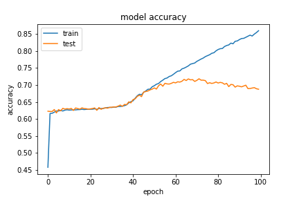
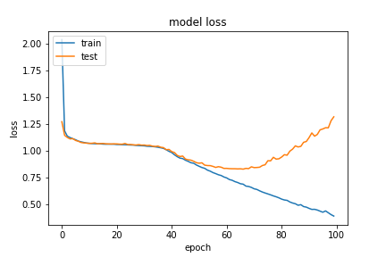

When we looked at the actual accuracy rate for our validation set, it was actually only ~8%, and almost 3% of all our predictions had an incorrect format that didn't have an end of expression token. Below are a couple of examples of how our model performed with the validation set at this stage:

```
Question,         Expected,   Predicted
(-33)/99*(-6)/4     1/2         1/7
-2*(-1)/7-16/56     0          -1/7
1/4*1040/195        4/3         2/#
4*26/60-6/15        4/3           1
(-1-(2-4))*5        5             -
2/((-126)/423)--7   2/7          -2
(56/10)/(-1)+5     -3/5         1//
55/(-110)+57/42     6/7         2/#
10*((-5)/(-10)+0)   5             0
-4*(-2)/3*10/40     2/3         1/5
```

At this stage, we had 9280 training examples, so, this is bad but not unexpected.

The situation got better with more data with around 46,000 training samples:

#### (20,5) with 0.5 of eligible data
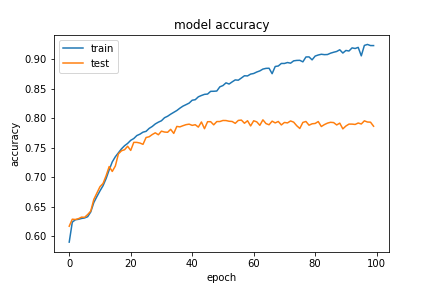
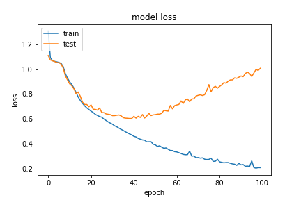

So, the increased validation accuracy on the second time means that increasing the number of samples in training gave us better results.
After getting these results, we tried our chance with the q,a length pair (30,10). This essentially meant that we now have a lot more question and answer pairs that are eligible for our setup, hence an increased training size. It also meant that we potentially have many answers with even more pad character added to the end of them, possbily distracting the NN from the interesting part. However, we intuitively thought that the embedding layer's mask_zero=True option would take care of this. So, we tried training our model for 0.1 of the (30,10) questions, which meant 48770 training samples, and got the following result:

#### (30,10) with 0.1 of eligible data
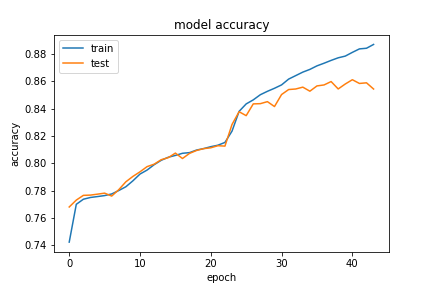
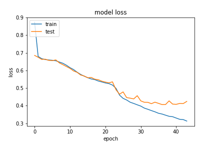

Note that at this time, we implemented an early stopping callback for the model to stop training when we haven't seen an improvement in valid loss for 7 epochs. This enabled us to test faster. We were able to achieve a validation accuracy of ~84%. The "actual" accuracy of the predictions matching the expected answer exactly was 23% this time, which means that the increase in the size of the training set overcompansates for extra added pad characters. Our next natural step was to increase the size of the data for the (30,10) questions, so we did that and got the following results:

#### (30,10) with 0.5 of eligible data
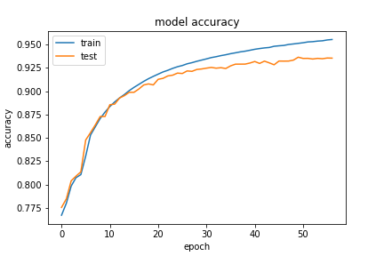
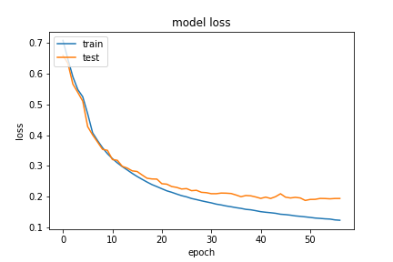

We had exactly 244,596 sample question and answer pairs this time, which shows how much our model's performance is dependant on the size of the dataset. We were satisfied with how much performance increase we got from the starting point. We then tried increasing the number of the encoder hidden states to see if that would have an effect on the performance for the last set of training samples. Here was our result:

#### (30,10) with 0.5 of eligible data with 256 hidden states for encoder layer
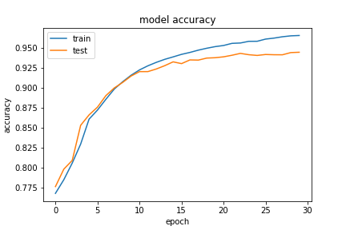
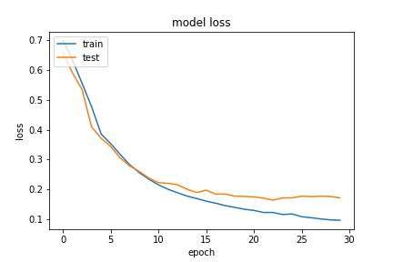

So, we see a small percentage increase in accuracy. For this setup, our "true accuracy" rate for the validation set was actually 66.9%, which is such an improvement from the previous numbers! This really took home the point that increasing the number of samples is the way to improve the model in our particular scenario. Below, we present a couple of the (answer, expected and prediction) tuples from our last and best model:

```
Question                  Expected       Predicted
(0+-6+2)*2/(-4)               2               2
(35/10-2)/(3/10)              5               5
Calculate 9/18*(-8)/22.     -2/11           -2/11
What is 1/3*(-27)/15?       -3/5            -3/5
What is 60/450*(-5)/3?      -2/9            -2/9
Evaluate (5-3)*1/5+-1.      -3/5            -2/5
(-5035)/(-29070)-2/36       2/17             1/1
Evaluate 36/135+77/(-120).  -3/8            -3/8
50/30+(-4)/3                 1/3             1/3
(198/693)/(10/(-14))        -2/5            -2/5
116/261+(-50)/72            -1/4            -1/4
23/(-115)-28/(-90)           1/9             1/1
```

Note how much our results got better compared to the first model. We also note that the answers are in the range 0-10 and they are usually fractions, so we hypothesize that our model will probably not generalize well to questions whose answers are big numbers. Making such evaluations of the model is something we would do if we had more time with our project.

## Ethical Implications

The model that we will be training may be used for good purposes, such as checking automatically if a student got the right answer in a question. However, our peers whom we were doing peer reviews with also suggested the dual usage of this work, and questioned if this kind of module could also be abused by students for cheating. As our model currently is fairly simple and is only able to solve arithmetic problems, and only ones that do not have many words in them, we believe that our models do not currently pose such a threat. In addition, our models were not as accurate for validation tests, implying that the model's predictions are far from being reliable. However, thinking about the future of NN models capable of reasoning mathematically, this might be a valid concern. A more advanced NN model would be capable of solving math problems used for encryption. Hackers with access to such technology could potentially use it to decrypt private information.

An additional consideration is the language used in our data set. Our NN is evaluated on math problems that are written in English. Such an NN cannot be expected to perform as equally for problems that are in a different language. This means the technology developed from this model would not be equally accessible to people of all languages. Such a model would not be usable for a person who does math in a preferred or native language other than English.

Some of our peers also pointed out the question of what the philosophical implications of a mathematically reasoning computer would be for the field of math. So, if future work can find solutions to problems that are not easily solvable by humans, it might lead to further discussions about the nature of some problems. However, we believe that this is not much different from the question of whether complex NN models like the GPT can actually convince us that they are using languages as humans do. Overall, even though a computer might look like it has algebraic reasoning, we would still question the relevance of this kind of "reasoning" to our own human reasoning.

## Reflections

We spent quite a bit of time trying to understand how exactly the input to the seq2seq network should look like.  While first trying to build a simple one LSTM and get it to have some kind of accuracy, we spent lots of time trying to figure things out on our own. Then, we decided to use a seq2seq model, which was much more approachable and fitting for our type of problem. There were also more guides on the internet for implementing seq2seq frameworks for similar questions. So, if we were to do this again, we would spend less time trying to figure the shape of the inputs from the official pytorch documentation and instead use architectures from problems that are similar to our own. This would allow us to also test more hyperparameters and get experience with what we would really need to do in real life applications. It would also allow us to try our model on the different modules. We also spent some time trying to figure out how to make the network ignore padding characters and not count them towards the loss function, becase not being able to ignore the pad characters caused our loss function to stagnate at some point. We finally achieved this by including an embedding layer with the mask_zero option enabled, which was not included in any of the seq2seq models for similar problems on the internet. So, this was an instance of us figuring out the solution to a problem on our own and was one of the better moments of our project. We also made the mistake of not letting our model train for long enough because we saw the valid accuracy metric not improving, however we learned from Prof. Clark that what we should really be looking at is the valid loss. Initially we were training our model on only 10 epochs, not being able to get good accuracy. So, when we let the training happen for much longer periods of time, it was a eureka moment. Overall, we think we learned a lot about how to match the sizes of the input and outputs for various layers of a NN, how to do encoding and decoding between various representations of network inputs and outputs, got experience with the torch, tensorflow and scikit libraries and got to see the difference between torch and tensorflow. Our experience with tensorflow proved to be much more seamless.

For future work, as we have mentioned before, we would like to be able to define an accuracy metric that is built into the model that reflects the accuracy we want to know about. We would also do a better job of analysing our data set and presenting some summary statistics if we had more time. We would have loved to evaluate our model on some questions whose answers were far too big, and we would like to try our model on different modules of the original dataset. We would have wanted to try different hyperparameters having to do with the network's architecture, like the hidden dimension of the LSTMs, the embedding dimension of the Embedding Layer and different los functions, in order to see if we can get a better actual accuracy than 66.9%. If we had the time and the resources, we would also try training the model on a larger question, answer length pair, and with all of the dataset if possible. Lastly, a very intriguing thing would be to implement a Transformer model for this problem, and compare it with the seq2seq LSTM model.

## Referenced Works

[**Text2Math: End-to-end Parsing Text into Math Expressions**](https://arxiv.org/abs/1910.06571)
(Yanyan Zou, Wei Lu. 2019)

[**Using neural networks to solve advanced mathematics equations**](https://ai.facebook.com/blog/using-neural-networks-to-solve-advanced-mathematics-equations/)

[**Analysing Mathematical Reasoning Abilities of Neural Models**](https://openreview.net/pdf?id=H1gR5iR5FX) (David Saxton et al. 2019)

[**Solving Math Equations with Neural Networks**](https://ai.plainenglish.io/solving-math-equations-with-neural-networks-f015351995e8)

[**Learn to add numbers with seq2seq NNs**](https://machinelearningmastery.com/learn-add-numbers-seq2seq-recurrent-neural-networks/)

[**Learning Math with LSTMs and Keras**](https://cpury.github.io/learning-math/)
